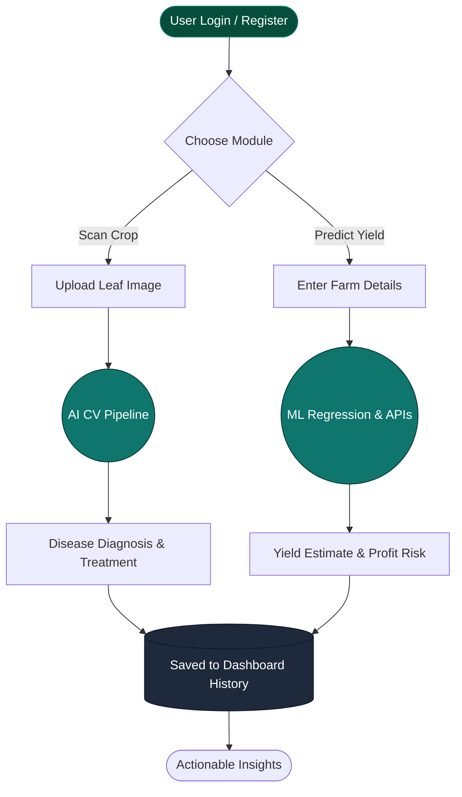
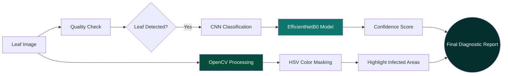
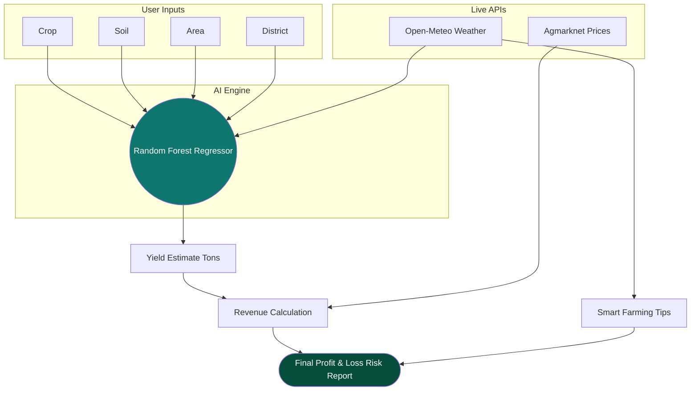
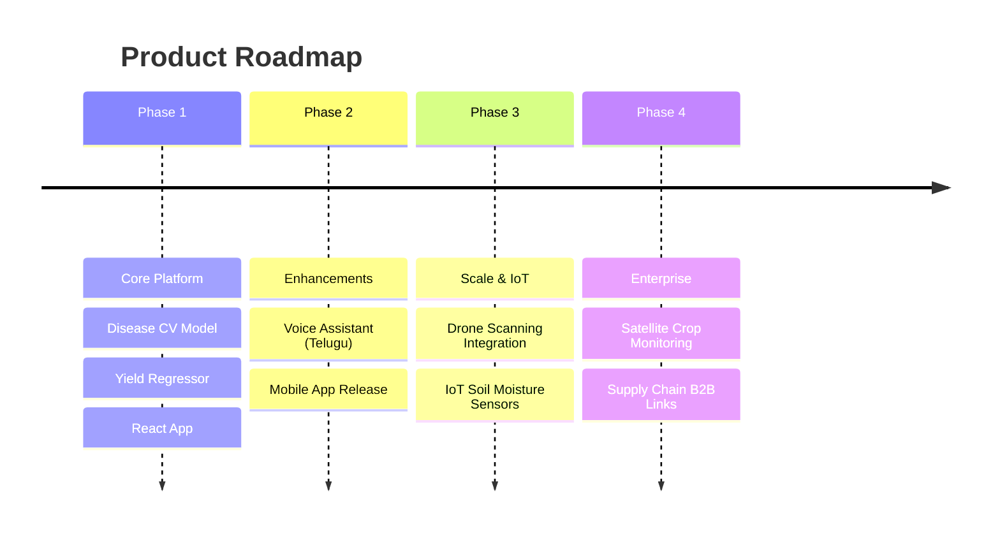

````carousel
# 🌾 AgroVision AI
### Smart Crop Disease Detection, Yield Prediction & Market Intelligence


**Prepared by:**
Nikhil Bontha
*B.Tech AIML | Anurag University*

<!-- slide -->
# Why Agriculture Needs AI

> [!WARNING]
> The Traditional Farming Crisis

| 🥀 The Problem | 🤖 The AI Solution |
| :--- | :--- |
| **Delayed Diagnosis:** Crops lost due to unidentified diseases. | **Instant Detection:** AI-driven computer vision spots diseases early. |
| **Unpredictable Weather:** Reactive farming leads to low yield. | **Proactive Planning:** Real-time weather APIs drive smart suggestions. |
| **Market Volatility:** Uninformed selling at low mandi prices. | **Market Intelligence:** Live price trends maximize farmer profit. |
| **Lack of Data:** Decisions based on guesswork. | **Analytics Dashboard:** Data-driven decisions based on historical records. |

<!-- slide -->
# Why AgroVision AI?

### The Shift from Reactive to Predictive Agriculture

Farmers lose significant portions of their crops annually due to delayed diagnosis and unpredictable environmental factors. Most small-to-medium farmers lack access to expensive analytics and agronomist consultations.

**AgroVision AI** bridges this gap by combining cutting-edge deep learning with real-time API integrations, transforming a farmer's smartphone into a digital agronomist.

**Before:** Guesswork, delayed treatment, financial loss.
**After:** Precise action, optimal yield, maximum revenue.

<!-- slide -->
# Real-world Use Cases

*AgroVision AI addresses 5 core challenges in modern agriculture:*

- 🔬 **Leaf Disease Detection:** Snap a photo of a sick leaf and instantly know the exact disease and treatment.
- 🌾 **Yield Estimation:** Predict harvest volume in tons before planting, based on soil type and weather.
- 📈 **Market Price Decision:** "Should I sell now or hold?" answered by live Agmarknet trend data.
- 🌤️ **Weather Monitoring:** Dynamic farming suggestions derived directly from Open-Meteo forecasts.
- 🌍 **Multilingual Accessibility:** Telugu support ensures technology reaches grassroots farmers.

<!-- slide -->
# Farmer Workflow



<!-- slide -->
# Product Overview

> [!TIP]
> Core Modules of the AgroVision Platform

| Module | Description |
| :--- | :--- |
| 🔍 **Disease Detection** | TensorFlow/Keras powered CNN image classification. |
| 📊 **Yield Prediction** | Scikit-Learn Random Forest regression engine. |
| 📈 **Market Intelligence** | Live fetching of localized crop prices and trends. |
| 📱 **Farmer Dashboard** | Centralized analytics, history tracking, and profiling. |
| 🌐 **Language Translation** | Seamless localization via i18next (English & Telugu). |

<!-- slide -->
# Disease Detection Workflow



<!-- slide -->
# Disease Detection Example

### 🍅 Tomato Early Blight Diagnosis

* **Input:** Raw user upload of a spotted tomato leaf.
* **OpenCV Output:** Image processed with red bounding boxes highlighting necrotic lesions.
* **Prediction:** Tomato Early Blight
* **Confidence:** 98.4%
* **Severity:** Medium (12 infected zones detected)
* **Suggested Treatment:** Remove infected leaves immediately. Apply a copper-based fungicide or Mancozeb. Avoid overhead watering.

<!-- slide -->
# Yield Prediction Workflow



<!-- slide -->
# Market Decision Engine

> [!IMPORTANT]
> The engine provides deterministic financial advice based on live data.

**Example Calculation (Wheat):**
- **Current Mandi Price:** ₹2,125 / Quintal
- **Trend:** +2.4% (Price increasing)
- **AI Decision:** 🟠 **HOLD**

### Financial Breakdown
* **Estimated Yield:** 14.5 Tons
* **Estimated Revenue:** ₹3,08,125
* **Estimated Input Cost:** ₹45,000
* **Expected Profit:** ₹2,63,125 (Low Risk)

<!-- slide -->
# System Architecture


<!-- slide -->
# Technology Stack

*A modern, asynchronous, and scalable stack.*

### 🖥️ Frontend
* **React.js 19** & **Vite**
* **Tailwind CSS** (Styling) & **Framer Motion** (Animations)
* **Recharts** (Analytics)

### ⚙️ Backend
* **FastAPI** (Python 3.11)
* **Motor** (Asynchronous MongoDB Driver)
* **JWT** (Authentication)

### 🧠 Machine Learning
* **TensorFlow & Keras** (CNN image classification)
* **OpenCV** (Image processing & contours)
* **Scikit-learn** (Random Forest Regressor)

<!-- slide -->
# Dashboard Analytics


*The dashboard provides farmers with an at-a-glance view of their farm's health, historical disease confidence metrics, and yield prediction trends.*

<!-- slide -->
# Business Impact

> [!NOTE]
> AgroVision empowers farmers, reduces financial risk, and modernizes the agricultural supply chain.

1. **Early Disease Detection** saves entire crop yields from spreading infections.
2. **Predictive Planning** helps farmers choose the right crop for the upcoming season's weather.
3. **Real Market Intelligence** prevents exploitation by middlemen, ensuring fair compensation.
4. **Data-Driven Farming** reduces unnecessary fertilizer and water waste, promoting sustainability.

<!-- slide -->
# Future Enhancements



<!-- slide -->
# Technical Q&A

**Q: Why Random Forest for Yield Prediction?**
> A: Random Forest handles non-linear relationships well (e.g., how humidity and temperature interact to affect yield) and is highly robust against overfitting with our tabular agricultural data.

**Q: Why FastAPI?**
> A: It provides out-of-the-box asynchronous support (async/await), making it incredibly fast for I/O operations like calling external weather APIs and writing to MongoDB, while auto-generating Swagger documentation.

**Q: How accurate is disease detection?**
> A: Our CNN architecture (EfficientNetB0/MobileNetV2) is optimized on the PlantVillage dataset, achieving upwards of 95% accuracy in controlled conditions, bolstered by OpenCV pre-processing.

**Q: How scalable is this?**
> A: Highly scalable. The decoupled frontend (Vercel) and backend (Docker/Render) architecture, alongside MongoDB Atlas and stateless JWT auth, allows horizontal scaling of the API.

<!-- slide -->
# Conclusion


### Sowing the Seeds of the Future
AgroVision AI is more than just an application; it is an ecosystem that combines artificial intelligence, real-time agricultural data, and a farmer-friendly interface to help Indian farmers make smarter, more profitable decisions.

**Thank You.**
````
